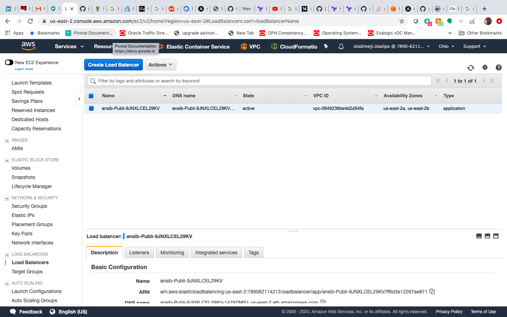

# Deploy containers using Elastic Container Service using CloudFormation and ansible

Getting started with ansible cloudformation module

# Requirements

The below requirements are needed on the host that executes this module.

boto
boto3
botocore>=1.5.45
python >= 2.6

# Setup ansible vault for your aws secrets and access keys

ansible-vault create <name-of-file.yml>

# Commands to run  the ECS-CLUSTER using your secrets

ansible-playbook ansible-cloudformation-cluster.yml  --vault-id @prompt

# Commannd to run the ECS-SERVICE using your secrets 

ansible-playbook ansible-cloudformation-service.yml  --vault-id @prompt

Several combinations of template are available in this folder. You can deploy containers with two different networking approaches:

- Public VPC subnet with direct internet access
- A public facing load balancer that accepts traffic from anyone on the internet (ideal for a public facing web service)

To use this template to launch a EC2 instance cluster  Then launch a service template for the EC2 Instance service you want to run in the cluster. When launching a service template its important to make sure the "StackName" value is filled in with the same name that you selected for the name of your cluster stack.

Each of the service stacks has default values prefilled for launching a simple Nginx container, but can be adjusted to launch your own container.

## Fully Public Container

This architecture deploys your container into its own VPC, inside a public facing network subnet. The containers are hosted with direct access to the internet, and they are also accessible to other clients on the internet via a public facing appliation load balancer.

### Run on EC2

1. Launch the [fully public](ansible-playbook ansible-cloudformation-cluster.yml  --vault-id @prompt) 
2. Launch the [public facing service template](ansible-playbook ansible-cloudformation-service.yml  --vault-id @prompt).

### Access the nginx sevice at 

